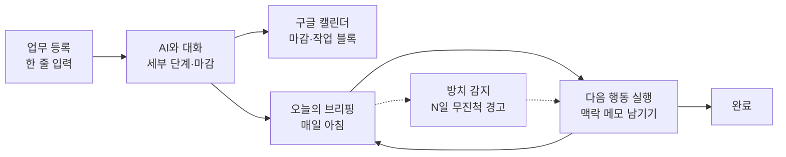

# 업무 놓침 방지 웹앱 PRD (초안)

작성일: 2026-09-23

## 개요

여러 업무를 동시에 진행할 때 한 꼭지가 시야에서 사라지는 것을 막는 개인용 웹앱이다. 핵심은 업무 등록이 아니라, 등록해 둔 업무를 매일 다시 눈앞에 끌어올리는 것이다.

**문제**: 급한 업무에 집중하는 사이 다른 업무를 잊는다. 특히 결재·회신 대기처럼 내 손을 떠난 업무, 며칠 손대지 않은 업무가 가장 쉽게 놓친다.

**목표**

- 진행 중인 모든 업무 꼭지를 하루 한 번 훑게 만든다
- 업무마다 "다음에 할 구체적 행동 하나"가 항상 정해져 있게 한다
- 방치되거나 마감이 위험한 업무를 먼저 알려준다
- AI와 대화하며 업무를 세부 단계와 타임라인으로 쪼갠다

**대상 사용자**: 학기 단위로 반복되는 업무와 여러 병렬 업무(수업, 평가, 예산, 연구회 등)를 동시에 맡는 교사 1인. 첫 버전은 본인 전용이다.

## 핵심 사용 흐름

업무는 등록 → 쪼개기 → 매일 브리핑 → 진행 기록 → 완료의 순환을 돈다. 브리핑과 방치 감지가 이 순환에서 빠진 업무를 다시 끌어올린다.

1. **등록**: 업무 이름과 대략적인 마감만 입력한다.
2. **쪼개기**: AI가 질문하며 세부 단계, 단계별 마감, 첫 번째 다음 행동을 제안하고 사용자가 확정한다.
3. **캘린더 반영**: 확정된 마감과 작업 시간이 구글 캘린더에 들어간다.
4. **브리핑**: 앱을 열면 모든 진행 업무가 한 줄씩, 오늘 할 다음 행동과 함께 보인다.
5. **진행**: 단계를 체크하고, 멈출 때 "어디까지 했고 다음엔 뭐부터"를 한 줄 남긴다.
6. **완료**: 마지막 단계 체크 시 업무를 보관함으로 옮긴다.

## 기능 요구사항 (1단계 MVP)

1단계는 8개 기능으로 "등록하고, 쪼개고, 매일 다시 보는" 최소 순환을 완성한다.

| 기능 | 설명 | 완료 조건 |
| --- | --- | --- |
| 분류 관리 | 사용자가 업무 분류를 직접 만들고 이름·색·순서를 정함. 기본값으로 담임, 수업, 행정업무, 개인 일정 제공 | 분류 추가·수정·삭제 가능, 삭제 시 해당 업무는 다른 분류로 옮김 |
| 업무 등록 | 업무명, 마감일(선택), 분류(사용자가 만든 목록에서 선택)를 입력 | 10초 안에 한 건 등록 가능 |
| AI 업무 쪼개기 | AI가 2~3개 질문 후 세부 단계·단계별 마감·첫 다음 행동을 제안, 사용자가 수정·확정 | 제안을 그대로 또는 고쳐서 저장 |
| 다음 행동 | 업무마다 지금 할 구체적 행동 1개를 항상 표시, 단계 완료 시 다음 단계로 자동 갱신 | 진행 중 업무에 빈 다음 행동이 없음 |
| 맥락 메모 | 작업을 멈출 때 "어디까지 / 다음엔 뭐부터" 한 줄 기록, 업무 카드 상단에 최신 메모 노출 | 업무를 열면 마지막 메모가 바로 보임 |
| 오늘의 브리핑 | 첫 화면. 진행 중 업무 전체를 한 줄씩, 마감 임박·방치 업무를 위로 정렬. 분류별로 묶어 보기·걸러 보기 가능 | 모든 업무가 한 화면에서 훑어짐 |
| 방치 감지 | 마지막 활동 후 N일(기본 3일) 지난 업무에 경고 표시 | 기준일 설정 가능, 경고 업무가 브리핑 상단에 표시 |
| 구글 캘린더 연동 | 업무·단계 마감을 종일 일정으로 등록, 원하면 작업 시간 블록 생성. 마감 변경 시 일정도 수정 | 앱에서 바꾼 마감이 캘린더에 반영됨 |

**AI 대화 원칙**: AI는 제안만 하고 저장은 사용자가 확정할 때만 한다. 질문은 한 번에 하나씩, 최대 3개까지.

## 단계별 로드맵

1단계를 2~3주 직접 써 본 뒤 2단계로 넘어간다. 노션 연동은 이번 범위에서 빼고 3단계 이후에 검토한다.

| 단계 | 초점 | 기능 |
| --- | --- | --- |
| 1단계 | 매일 다시 보기 | 업무 등록, AI 쪼개기, 다음 행동, 맥락 메모, 오늘의 브리핑, 방치 감지, 구글 캘린더 연동 |
| 2단계 | 놓침 방지 강화 | 공 넘겨놓은 일 추적(결재·회신 대기, N일 무응답 알림), 빠른 던져넣기(한 줄 입력 → AI가 업무에 배정), 주간 회고(금요일 5분 대화), 바탕화면·홈 화면 위젯(오늘의 다음 행동과 방치 경고만 요약 표시), 공문 붙여넣기(AI가 기한·제출물을 뽑아 업무 생성), 메일에서 업무 가져오기(Gmail 라벨), 자주 하는 업무 템플릿(품의·출장·평가계획 등), 시간표 연동 짜투리 모드(공강 시간에 할 수 있는 작은 행동 추천) |
| 3단계 | 쌓일수록 좋아지기 | 작년 업무 복제(반복 업무 타임라인 재사용), 학사일정 겹침 경고, 이번 주 용량 체크, 업무별 자료함(파일 링크·메모·AI 대화 기록), 학기말 한 일 모아보기(분류별 완료 업무 정리), 선후 관계 표시(앞 업무가 밀리면 뒤 업무 위험 경고) |
| 추후 | 외부 연동 | 노션 연동(저장소로 쓸지, 내보내기만 할지 결정 필요) |

## 데이터 구조 및 기술 스택

백엔드는 Supabase 무료 요금제 하나로 통일한다. 구글 캘린더·Gmail은 Supabase Auth의 구글 로그인에서 받은 토큰으로 Edge Function이 직접 호출한다. Supabase 무료 요금제는 DB 500 MB, 활성 프로젝트 2개까지이고, 1주일간 활동이 없으면 일시 정지된다([Supabase 요금 안내](https://supabase.com/pricing)).

| 구성 요소 | 선택 | 역할 |
| --- | --- | --- |
| 화면 | 정적 웹앱 (무료 호스팅, 예: Vercel) | 브리핑·업무·분류 화면, PC·폰 브라우저 모두 지원 |
| 데이터 | Supabase PostgreSQL | 분류·업무·단계·활동 기록 저장, 행 단위 보안(RLS)으로 본인만 접근 |
| 로그인 | Supabase Auth (구글 로그인) | 본인 계정 1개만 허용, 캘린더·Gmail 권한을 함께 요청하고 갱신 토큰 저장 |
| 서버 로직 | Supabase Edge Functions | AI 호출(업무 쪼개기·공문 분석), 구글 캘린더 일정 생성·수정, Gmail 라벨 메일 가져오기 |
| 예약 작업 | pg_cron → Edge Function | 매일 방치 감지 계산, 주기적 Gmail 확인, 주 1회 백업 |

**테이블 구조**

| 테이블 | 주요 열 |
| --- | --- |
| 분류 | ID, 분류명, 색, 표시 순서 |
| 업무 | ID, 업무명, 분류 ID, 마감일, 상태, 다음 행동, 최근 맥락 메모, 마지막 활동일, 캘린더 일정 ID, 캘린더 동기화 필요 여부 |
| 단계 | ID, 업무 ID, 순서, 단계명, 마감일, 완료 여부, 캘린더 일정 ID |
| 활동 기록 | 시각, 업무 ID, 종류(체크·메모·수정), 내용 |

방치 감지는 업무 테이블의 "마지막 활동일"로 계산한다. 활동 기록 테이블은 2단계 주간 회고와 3단계 작년 업무 복제·학기말 모아보기의 재료가 된다. 무료 요금제는 자동 백업이 없어, 예약 작업이 주 1회 전체 데이터를 Supabase Storage에 JSON으로 내보낸다.

**구글 연동 주의점**: 구글 클라우드의 OAuth 앱이 테스트 모드면 갱신 토큰이 7일마다 만료된다. 본인 전용이면 앱을 게시 상태로 두고 미인증 경고 화면을 감수하는 방식으로 쓴다. 캘린더는 먼저, Gmail은 2단계에서 권한을 추가한다.

위젯을 위해 Supabase에 오늘의 요약(다음 행동·방치 경고)만 돌려주는 읽기 전용 주소를 하나 둔다. PC는 Lively Wallpaper(윈도우)·Plash(맥), 폰은 Scriptable(아이폰)·KWGT(갤럭시)가 이 주소를 읽어 표시한다. 마감은 구글 캘린더 위젯으로도 바로 볼 수 있다.

## 성공 기준, 범위 밖, 열린 질문

**성공 기준** (1단계 사용 2~3주 후)

- 주 5일 이상 앱을 열어 브리핑을 확인한다
- 마감을 놓친 업무가 0건이다
- 방치 경고를 받은 업무의 절반 이상이 이틀 안에 다시 진행된다

**범위 밖 (1단계)**

- 노션 연동
- 다른 교사와의 공유·협업
- 모바일 푸시 알림 (브리핑은 앱을 열었을 때만 표시)

**열린 질문**

- [ ] 쓸 AI API는 무엇으로 할지, 비용 한도는 얼마로 둘지
- [ ] 캘린더에 단계 마감까지 모두 넣을지, 업무 최종 마감만 넣을지
- [ ] 방치 기준일을 업무 분류별로 다르게 둘지
- [ ] 브리핑을 앱 화면 외에 아침 메일로도 받을지
